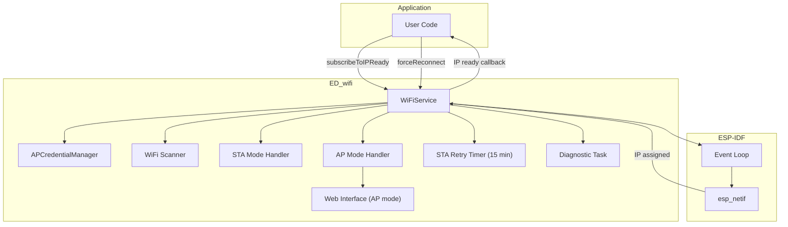

# ED_wifi – Full Documentation

The **ED_wifi** component provides a robust, self‑healing WiFi connection manager for ESP‑IDF. It supports multiple stored credentials, automatic fallback to Access Point (AP) mode when no known network is reachable, periodic diagnostics, and seamless recovery from network outages – all with zero‑heap dynamic allocation.

## Table of Contents
- [ED\_wifi – Full Documentation](#ed_wifi--full-documentation)
  - [Table of Contents](#table-of-contents)
  - [Overview](#overview)
  - [Architecture Diagram](#architecture-diagram)
  - [Connection \& Fallback Logic](#connection--fallback-logic)
  - [APCredentialManager](#apcredentialmanager)
  - [Web Interface (AP mode)](#web-interface-ap-mode)
  - [API Reference](#api-reference)
    - [WiFiService](#wifiservice)
    - [APCredential](#apcredential)
    - [APCredentialManager](#apcredentialmanager-1)
    - [MacAddress](#macaddress)
  - [Usage Examples](#usage-examples)
    - [1. Basic Launch](#1-basic-launch)
    - [2. Adding Custom Wi‑Fi Credentials](#2-adding-custom-wifi-credentials)
    - [3. Subscribing to IP‑Ready Events](#3-subscribing-to-ipready-events)
    - [4. Getting Current AP Info](#4-getting-current-ap-info)
  - [Diagnostics \& Logging](#diagnostics--logging)
  - [NVS Storage](#nvs-storage)
  - [Dependencies \& Integration](#dependencies--integration)
  - [Summary](#summary)

---

## Overview

`ED_wifi` is a singleton‑oriented static class that handles all Wi‑Fi operations. Key features:

- **Multi‑AP support** – Up to 10 stored credentials (SSID/password), loaded from firmware defaults (`secrets.h`) plus NVS overrides.
- **Automatic scan & selection** – Scans all channels, matches detected APs against stored credentials, and connects to the strongest reachable network.
- **Fallback to AP mode** – If no known network is found (or after repeated connection failures), the device switches to AP mode with a configurable SSID (derived from the device’s network name). A web interface (simple HTTP server) allows users to update credentials on the fly.
- **Self‑healing timers** – Periodic retry timers attempt to switch back to STA mode after a configurable delay (default 15 minutes) when operating in AP mode.
- **Diagnostic task** – Every 60 seconds, logs current AP, RSSI, heap, stack high‑water mark, and uptime.
- **Event‑driven** – Uses the ESP‑IDF event loop to react to `WIFI_EVENT` and `IP_EVENT`.

The design is fully static – no dynamic allocations after initialisation, and all callback tables are fixed‑size arrays.

---

## Architecture Diagram



---

## Connection & Fallback Logic

The connection flow is fully event‑driven:

1. **Launch** – `WiFiService::launch()` initialises NVS, event loop, netif, and Wi‑Fi driver. It sets the hostname (based on `ED_SYS::ESP_std::Device::netwName()`) and starts STA mode.

2. **Scan** – On `WIFI_EVENT_STA_START`, a blocking scan (`scan_wifi_networks()`) is performed. All detected APs are matched against known credentials.

3. **Select best AP** – `APCredentialManager::setNextActiveAP()` sorts the detected, connectable APs by RSSI and selects the strongest.

4. **Connect** – `wifi_conn_STA()` configures the station with the selected AP’s SSID and password, then starts Wi‑Fi.

5. **On success** – `IP_EVENT_STA_GOT_IP` triggers all subscribers (e.g., MQTT dispatcher) and stops the STA retry timer.

6. **On failure** – `WIFI_EVENT_STA_DISCONNECTED` increments a retry counter.
   - If retries < `MAX_RETRY` (10 in release, 4 in debug), a short‑delay timer (`staRetryDelayed`, 2 seconds) calls `esp_wifi_connect()` again with the same AP.
   - If max retries exceeded, `APCredentialManager::setNextActiveAP()` tries the next best AP. If none remain, the device switches to **AP mode** via `wifi_conn_AP()` and starts the long‑delay timer (`staRetryTimer`, default 15 minutes). When that timer fires, it restarts STA mode and repeats the scan.

7. **Forced reconnect** – `WiFiService::forceReconnect()` can be called externally (e.g., from the MQTT dispatcher’s multi‑level recovery) to stop all timers, reset retry counters, and immediately restart STA mode.

This design ensures the device always tries to stay connected to the best available network and falls back to an accessible AP mode for manual reconfiguration.

---

## APCredentialManager

The `APCredentialManager` (inner class) stores up to 10 AP credentials (SSID, password, connectable flag). Credentials are loaded from:

- **Firmware defaults** – Defined by `ED_WIFI_CREDENTIALS` in `secrets.h`. Example:
  @@c
  #define ED_WIFI_CREDENTIALS \
      {"HomeNet", "password123", "C"}, \
      {"GuestNet", "", "U"}
  @@
  - `"C"` or any char except `'0'`, `'u'`, `'U'` means connectable (password required).
  - `"U"`, `"u"`, or `"0"` means unconnectable (monitoring only, no connection attempt).

- **NVS overrides** – Credentials added via the web interface are saved to NVS under the namespace `"Config_WiFi"`. They take precedence over firmware defaults (or add new ones).

The manager also tracks real‑time RSSI and channel for each known AP, and provides a sorted list of currently visible, connectable APs.

**Key methods:**
- `addOrUpdate(ssid, password, canConnect)` – Adds or updates a credential in the runtime list.
- `addOrUpdateToNVS(ssid, password)` – Persists a credential to NVS.
- `setNextActiveAP()` – Selects the next best visible AP for connection (used after failures).
- `updateDetectedAPs()` – Called after a scan to update RSSI and visibility of known APs.

---

## Web Interface (AP mode)

When the device falls back to AP mode, it starts a simple HTTP server on port 80. The web interface (only one page) allows users to submit new Wi‑Fi credentials.

- **Root (`/`)** – GET request returns an HTML form with fields for SSID and password.
- **Set AP (`/set_ap`)** – POST request saves the submitted SSID/password to NVS and adds it to the runtime credential list.

After submitting, the device will eventually (via the STA retry timer) switch back to STA mode and attempt to connect using the new credentials.

The web interface is basic but sufficient for headless device configuration.

---

## API Reference

### WiFiService

All methods are **static**. The class is not instantiable.

| Method | Description |
|--------|-------------|
| `esp_err_t launch()` | Initialises all Wi‑Fi components and starts the connection process. Must be called once. |
| `void forceReconnect()` | Stops all retry timers, resets counters, and restarts STA mode (for external recovery). |
| `void subscribeToIPReady(std::function<void()> callback)` | Registers a callback that runs when a DHCP lease is obtained (IP ready). |
| `std::optional<CurrentAPInfo> getCurrentAPInfo()` | Returns the SSID and RSSI of the currently connected AP, or `std::nullopt` if not connected. |

**Constants (configurable via pre‑processor):**
- `MAX_RETRY` – 10 (release) / 4 (debug) – number of connection retries per AP.
- `ReconnectDelay_ms` – 2000 ms – delay before retrying the same AP.
- STA retry timer interval – 15 minutes (in release) – time in AP mode before retrying STA.

### APCredential

Structure representing a single AP entry.

| Field | Description |
|-------|-------------|
| `char ssid[ED_MAX_SSID_PWD_SIZE]` | Network name (max 19 chars). |
| `char password[ED_MAX_SSID_PWD_SIZE]` | Password (max 19 chars). |
| `APType type` – `AP_CONNECTABLE` or `AP_UNCONNECTABLE`. | |
| `int8_t RSSI` | Latest signal strength in dBm. |
| `uint8_t chann` | Wi‑Fi channel. |
| `uint32_t lastSeen` | Timestamp (seconds) of last detection. |

**Methods:**
- `bool matches(const char* targetSsid)` – Checks if the stored SSID matches the given one.
- `static int compare_rssi_desc(const void* a, const void* b)` – Comparator for sorting by descending RSSI.

### APCredentialManager

Static management class (no instances).

| Method | Description |
|--------|-------------|
| `static bool addOrUpdate(const char* ssid, const char* pwd, bool canConnect)` | Adds/updates a credential in the runtime list. |
| `static esp_err_t addOrUpdateToNVS(const char* ssid, const char* pwd)` | Saves a credential to NVS. |
| `static bool remove(const char* ssid)` | Removes a credential from runtime list. |
| `static const char* getSSID(size_t index)` | Returns the SSID of the stored credential at `index`. |
| `static bool setNextActiveAP()` | Moves to the next best visible AP for connection. Returns `false` if no AP available. |
| `static void updateDetectedAPs(uint16_t number, wifi_ap_record_t* records)` | Updates RSSI and visibility of known APs after a scan. |

### MacAddress

Utility class for handling MAC addresses (6 bytes).

| Method | Description |
|--------|-------------|
| `const uint8_t* get() const` | Returns pointer to the MAC array. |
| `uint8_t* set()` | Returns pointer to the internal array for writing. |
| `char* toString(char* buffer, size_t buffer_size) const` | Formats MAC as `"XX:XX:XX:XX:XX:XX"`. |

---

## Usage Examples

### 1. Basic Launch

```cpp
#include "ED_wifi.h"

extern "C" void app_main() {
    // Initialise and start Wi-Fi (blocking until connection or AP fallback)
    esp_err_t err = ED_wifi::WiFiService::launch();
    if (err != ESP_OK) {
        ESP_LOGE("MAIN", "WiFi launch failed");
    }
}
```

### 2. Adding Custom Wi‑Fi Credentials

```cpp
#include "ED_wifi.h"

void add_network(const char* ssid, const char* password) {
    // Add to runtime list
    ED_wifi::WiFiService::APCredentialManager::addOrUpdate(ssid, password, true);
    // Persist to NVS (so it survives reboot)
    ED_wifi::WiFiService::APCredentialManager::addOrUpdateToNVS(ssid, password);
}
```

### 3. Subscribing to IP‑Ready Events

```cpp
#include "ED_wifi.h"

static void on_ip_ready() {
    ESP_LOGI("APP", "IP obtained, starting MQTT...");
    // Start MQTT dispatcher or other services
}

void app_main() {
    ED_wifi::WiFiService::subscribeToIPReady(on_ip_ready);
    ED_wifi::WiFiService::launch();
}
```

### 4. Getting Current AP Info

```cpp
#include "ED_wifi.h"

void print_current_ap() {
    auto info = ED_wifi::WiFiService::getCurrentAPInfo();
    if (info.has_value()) {
        ESP_LOGI("APP", "Connected to %s, RSSI=%d", info->ssid, info->rssi);
    } else {
        ESP_LOGW("APP", "Not connected to any AP");
    }
}
```

---

## Diagnostics & Logging

A dedicated task (`wifi_diag_task`) runs every 60 seconds and prints:
- Currently connected AP, RSSI, channel (or “Not connected”)
- Free heap size
- Uptime in seconds
- Stack high‑water mark of the diagnostic task

These logs help monitor network stability and resource usage.

---

## NVS Storage

Credentials added via `addOrUpdateToNVS()` are stored in the NVS namespace `"Config_WiFi"`. Keys are `"ssid_0"`, `"spwd_0"`, `"ssid_1"`, `"spwd_1"`, etc. The system automatically loads these on next boot and merges them with firmware defaults. There is no explicit maximum number of stored entries – but the runtime manager holds only the first 10 credentials (firmware + NVS). If more are present in NVS, only the first 10 are loaded.

To clear NVS credentials, you can erase the entire NVS partition or manually delete the keys.

---

## Dependencies & Integration

- **ED_sys** – Provides device name (`ED_SYS::ESP_std::Device::netwName()`) for hostname.
- **ED_nvs** – Wrapper for NVS operations (used by `addOrUpdateToNVS()`).
- **ESP‑IDF components** – `esp_wifi`, `esp_event`, `esp_netif`, `nvs_flash`, `esp_http_server`.

**CMakeLists.txt** (for a component using ED_wifi):
```cmake
idf_component_register(SRCS "my_component.cpp"
                       INCLUDE_DIRS "."
                       REQUIRES ED_wifi)
```

The component `ED_wifi` itself requires:
```cmake
idf_component_register(SRCS "ED_wifi.cpp"
                       INCLUDE_DIRS "."
                       REQUIRES nvs_flash esp_wifi esp_event esp_netif esp_http_server ED_sys ED_nvs)
```

---

## Summary

`ED_wifi` provides a complete, production‑ready Wi‑Fi solution for ESP‑IDF. It handles multiple credentials, automatic fallback to AP mode with a web interface, self‑healing timers, and external forced reconnect. The component is fully static and designed for headless devices that must remain reachable at all times. Together with the MQTT dispatcher’s multi‑level recovery, it forms a resilient connectivity stack.
```