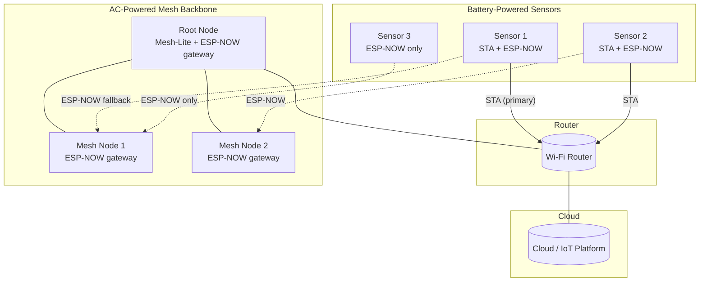
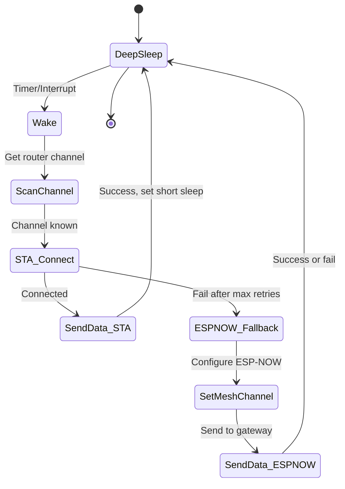

# Comprehensive Network Strategy for ESP32-Based IoT System

This document synthesizes the design discussion about integrating traditional Wi‑Fi STA mode, ESP‑Mesh‑Lite, and ESP‑NOW into a single robust, low‑power, and fault‑tolerant network architecture.

## 1. Core Communication Modes

### 1.1 Traditional STA (Station) Mode
- **Use case**: Battery‑powered or simple devices that can connect directly to a home/industrial Wi‑Fi router.
- **Characteristics**:
  - Low latency, high throughput.
  - Low power consumption when used with deep sleep.
  - Limited range – depends on router’s coverage.
- **Your library**: `ED_wifi` provides credential management, scanning, retries, and AP fallback.

### 1.2 ESP‑Mesh‑Lite
- **Use case**: AC‑powered devices that need to extend network range, self‑healing, and redundancy.
- **Characteristics**:
  - All nodes (including leaves) keep SoftAP active → **>100 mA continuous draw**.
  - Each hop adds latency and reduces throughput.
  - Maximum stable node count: ~100 nodes.
  - Root node bridges mesh to external router (or works root‑less).
- **Limitations for battery**: Leaf nodes cannot deep sleep because SoftAP must stay active.

### 1.3 ESP‑NOW
- **Use case**: Low‑power, peer‑to‑peer communication, often as a fallback or for simple sensor networks.
- **Characteristics**:
  - Connectionless, no handshake.
  - Very low overhead, allows deep sleep between packets.
  - Maximum payload: 250 bytes.
  - Requires all peers to be on the same Wi‑Fi channel.
  - Can coexist with STA mode if channel is aligned.

## 2. Proposed Hybrid Architecture

The goal is to combine the strengths of all three modes while mitigating their weaknesses. The architecture consists of:

- **AC‑powered backbone** using ESP‑Mesh‑Lite for range extension and redundancy.
- **Battery‑powered end devices** that try STA first, then fall back to ESP‑NOW to the nearest backbone node.
- **Optional**: AC nodes can also run ESP‑NOW listeners to accept fallback traffic.

### 2.1 Topology Diagram



### 2.2 Node Roles and Responsibilities

| Role | Power Source | Primary Mode | Fallback Mode | Responsibilities |
|------|--------------|--------------|---------------|------------------|
| **Root Node** | AC | Mesh‑Lite (STA to router + SoftAP to children) | ESP‑NOW (listener) | Bridge to internet; maintain mesh; forward ESP‑NOW packets into mesh |
| **Mesh Node** | AC | Mesh‑Lite (parent‑child) | ESP‑NOW (listener) | Relay mesh traffic; accept ESP‑NOW fallback from battery devices |
| **Battery Sensor** | Battery | STA (direct to router) | ESP‑NOW (send to nearest AC node) | Wake, sense, try STA, if fail → ESP‑NOW, then deep sleep |

## 3. Fallback Logic for Battery-Powered Devices

### 3.1 State Machine



### 3.2 Detailed Workflow

1. **Wake** from deep sleep (RTC timer or external interrupt).
2. **Channel discovery** – quickly listen for router beacon or use stored channel.
3. **STA attempt** – connect to router using credentials from `ED_wifi`.
   - If successful → send data (MQTT/HTTP), then deep sleep for **short interval** (e.g., 5 min).
4. **Fallback (STA failed)** – stop STA mode, initialise ESP‑NOW.
5. **Channel alignment** – set Wi‑Fi channel to the one used by the AC mesh backbone (must be pre‑configured or discovered via scanning).
6. **Send via ESP‑NOW** – send the sensor data packet to a known gateway MAC address (one or more AC nodes).
7. **Deep sleep** – regardless of ESP‑NOW success, go to **longer sleep** (e.g., 30 min) to conserve battery.

### 3.3 Example Code Skeleton (for battery device)

```c
// Simplified – use your ED_wifi for STA part
void sensor_task(void) {
    // 1. Wake and get router channel
    uint8_t router_channel = get_router_channel();  // from beacon or cache

    // 2. Try STA connection
    if (ed_wifi_connect_timeout(router_channel, 5000) == ESP_OK) {
        send_data_via_mqtt();
        ed_wifi_disconnect();
        deep_sleep(5 * 60);  // 5 min
    }

    // 3. Fallback: ESP-NOW
    esp_now_init();
    esp_now_add_peer(gateway_mac, ESP_NOW_ROLE_COM, mesh_channel, NULL, 0);
    esp_wifi_set_channel(mesh_channel, WIFI_SECOND_CHAN_NONE);
    esp_now_send(gateway_mac, sensor_data, len);
    esp_now_deinit();
    deep_sleep(30 * 60);  // 30 min
}
```

## 4. AC-Powered Backbone Configuration

### 4.1 Mesh‑Lite Setup (with Kconfig fragments)

You prefer Kconfig fragments over `menuconfig`. Example fragment `mesh_backbone.config`:

```kconfig
CONFIG_ESP_WIFI_MESH_LITE_ENABLE=y
CONFIG_MESH_LITE_ID=0x1234
CONFIG_MESH_LITE_MAX_LEVEL=4
CONFIG_MESH_LITE_MAX_CONNECTION=6
CONFIG_ESP_MESH_LITE_OTA_ENABLE=y
# Enable ESP‑NOW listener on the same channel
CONFIG_ESP_NOW_ENABLE=y
```

### 4.2 ESP‑NOW Gateway Service on AC Nodes

Each AC node runs a simple ESP‑NOW receive callback that injects packets into the mesh:

```c
void espnow_recv_cb(const uint8_t *mac, const uint8_t *data, int len) {
    // Forward data to mesh (e.g., via esp_mesh_lite_msg_send to root)
    esp_mesh_lite_msg_send(ROOT_ADDR, data, len);
}

// In node init
esp_now_register_recv_cb(espnow_recv_cb);
```

## 5. Power & Performance Considerations

| Aspect | STA (success) | ESP‑NOW fallback |
|--------|---------------|------------------|
| **Time awake** | ~1.5 s (connect + send) | ~500 ms (ESP‑NOW send only) |
| **Energy per cycle** | Low (single hop) | Very low (no handshake) |
| **Deep sleep interval** | Short (e.g., 5 min) | Long (e.g., 30 min) |
| **Network reliability** | Requires router coverage | Uses mesh backbone, more robust |
| **Data rate** | High (up to 20 Mbps) | Low (<1 Mbps, limited payload) |

**Recommendation**: Use the fallback only as a safety net. Most battery devices should successfully use STA if router coverage is adequate. The fallback ensures that devices at the edge of coverage remain operational.

## 6. Deployment Strategy

1. **Install AC‑powered mesh nodes** at strategic locations (e.g., every 30–50 meters indoors, further outdoors).
2. **Configure the mesh** with a fixed channel (e.g., channel 6) and the same `mesh_id` on all nodes.
3. **Flash battery sensors** with dual‑mode firmware (STA + ESP‑NOW fallback) and store:
   - Router credentials (from `secrets.h`).
   - Gateway MAC addresses (from the AC nodes).
   - The fixed mesh channel.
4. **Monitor** the system:
   - Log fallback occurrences → indicates weak router coverage.
   - Adjust placement of AC nodes or add more to eliminate fallback if desired.

## 7. Limitations and Caveats

- **Channel alignment** is critical. If the router changes channel (auto‑channel selection), battery devices may fail STA and then send ESP‑NOW on the old mesh channel. Solution: have battery devices scan for both router and mesh beacons at wake‑up.
- **ESP‑NOW maximum peers** is limited (usually 20). AC nodes can accept many senders without pairing as peers if using broadcast, but that reduces security. Use unicast with a limited set of known MACs.
- **Mesh‑Lite OTA** works only on AC nodes; battery devices need separate OTA (e.g., via STA mode when connected).

## 8. Summary

This hybrid approach gives you:

- **Low power** for battery devices (deep sleep, fast ESP‑NOW fallback).
- **Long range** and **self‑healing** from the AC‑powered mesh backbone.
- **Resilience** – if the router is unreachable, sensors still send data through the mesh.
- **Gradual upgrade path** – you can add AC mesh nodes over time without changing battery sensor firmware (as long as they know the mesh channel and at least one gateway MAC).

Your existing `ED_wifi` library continues to be the core for STA operations; we simply add an ESP‑NOW layer as a secondary path.
```