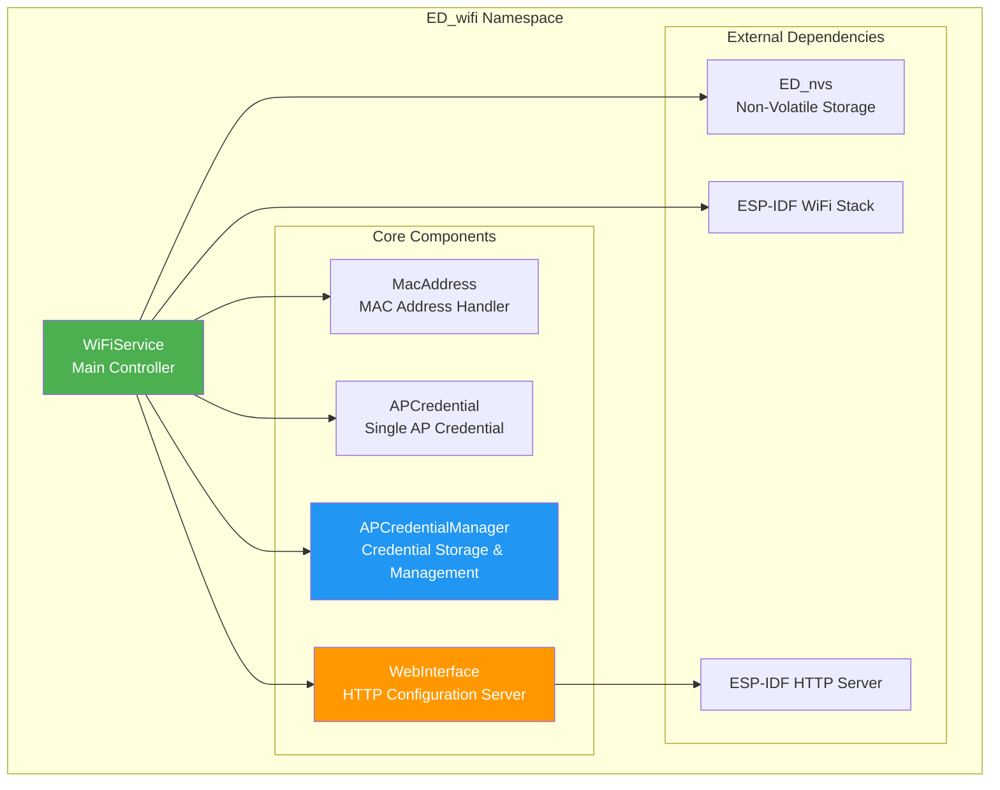
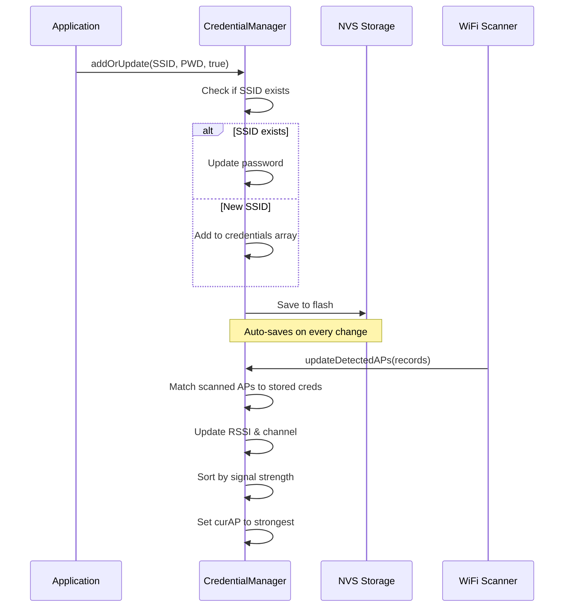
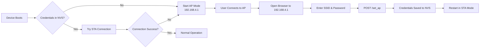
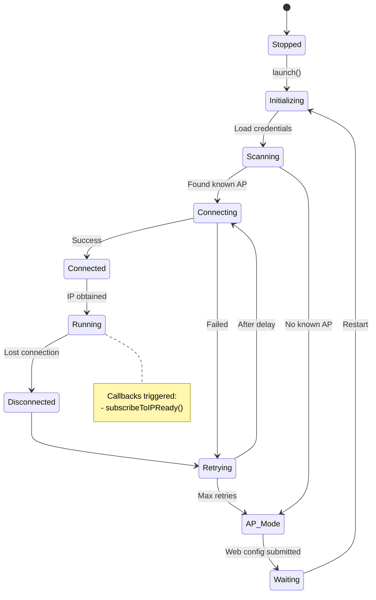
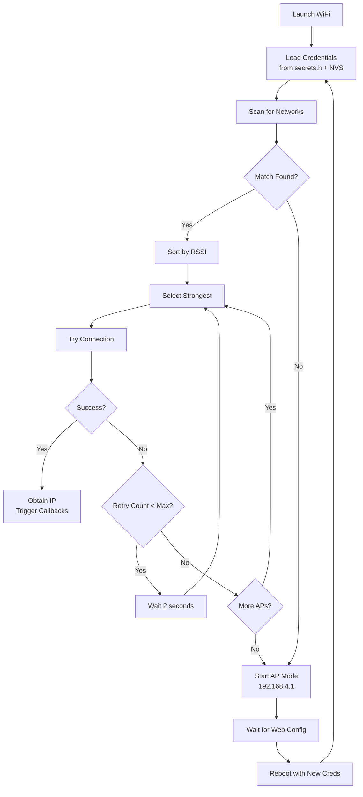

# ED_wifi Component Documentation

## Overview

The `ED_wifi` namespace provides a comprehensive WiFi management solution for ESP32 devices. It handles station (STA) and access point (AP) modes, credential management, network scanning, and includes a web interface for configuration.

## Architecture



## Component Details

### 1. MacAddress Class

**Purpose**: Efficient handling of MAC addresses with minimal memory footprint.

**When to Use**:
- When you need to read or format the device's MAC address
- For network identification and logging

**Key Methods**:
```cpp
// Create from existing MAC
MacAddress(const uint8_t mac[6]);

// Read access
const uint8_t& operator[](size_t index) const;
const uint8_t* get() const;

// Write access
uint8_t* set();

// Format to string (buffer must be ≥18 chars)
char* toString(char* buffer, size_t buffer_size) const;
```

**Example**:
```cpp
#include <ED_wifi.h>

using namespace ED_wifi;

void printDeviceMAC() {
    char macStr[18];
    WiFiService::station_mac.toString(macStr, sizeof(macStr));
    ESP_LOGI("TAG", "Device MAC: %s", macStr);
}
```

---

### 2. APCredential Class

**Purpose**: Represents a single WiFi Access Point credential with metadata.

**When to Use**:
- Rarely used directly by application code
- Internally managed by `APCredentialManager`
- Useful for understanding credential structure

**Structure**:
```cpp
class APCredential {
    char     ssid[19];      // SSID (max 18 chars + null)
    char     password[19];  // Password (max 18 chars + null)
    APType   type;          // Connectable or Unconnectable
    int8_t   RSSI;          // Signal strength in dBm
    uint8_t  chann;         // WiFi channel
    uint32_t lastSeen;      // Last detection timestamp
};
```

**AP Types**:
- `AP_CONNECTABLE (1)`: Valid credentials available for connection
- `AP_UNCONNECTABLE (0)`: Monitored only (interference tracking)

---

### 3. APCredentialManager Class

**Purpose**: Static manager for storing, updating, and selecting WiFi credentials.

**When to Use**:
- **At Boot**: Automatically loads credentials from `secrets.h` and NVS
- **Runtime**: Add new networks via Web Interface or programmatically
- **Diagnostics**: Check available networks and signal strengths

**Key Features**:
- Stores up to **10 SSIDs**
- Auto-sorts by signal strength (RSSI)
- Persists credentials to NVS
- Tracks both connectable and unconnectable APs

#### Public API

```cpp
// Add or update a credential
static bool addOrUpdate(const char* ssid, const char* password, bool canConnect);

// Save to NVS (called automatically)
static esp_err_t addOrUpdateToNVS(const char* ssid, const char* password);

// Get current count of connectable credentials
static size_t getConnCredentialsQty();

// Get SSID by index
static const char* getSSID(size_t index);

// Remove a credential
static bool remove(const char* ssid);

// Get currently active AP (auto-selected by best RSSI)
static const APCredential* curAP;
```

**Example - Adding a Network Programmatically**:
```cpp
#include <ED_wifi.h>

using namespace ED_wifi;

void addNewNetwork() {
    bool success = WiFiService::APCredentialManager::addOrUpdate(
        "MyNetwork",      // SSID
        "SecretPass123",  // Password
        true              // Can connect
    );

    if (success) {
        ESP_LOGI("WIFI", "Network added successfully");
        // Credentials automatically saved to NVS
    } else {
        ESP_LOGE("WIFI", "Failed to add network (storage full?)");
    }
}
```

#### Internal Workflow



---

### 4. WebInterface Class

**Purpose**: Provides HTTP server for WiFi configuration via web browser.

**When to Use**:
- **First-time Setup**: Device starts in AP mode
- **Network Changes**: Add/modify WiFi credentials
- **Diagnostics**: View connection status

**Endpoints**:
| Method | Endpoint | Description |
|--------|----------|-------------|
| GET | `/` | Configuration web page |
| POST | `/set_ap` | Submit new WiFi credentials |

**Usage Flow**:


**Important Notes**:
- ⚠️ **Password Limit**: SSIDs and passwords limited to **18 characters**
- 🔒 **Security**: AP mode has no authentication (use only for setup)
- 💾 **Persistence**: All changes saved to NVS immediately

---

### 5. WiFiService Class (Main Controller)

**Purpose**: Orchestrates all WiFi operations as a singleton service.

**When to Use**:
- **Initialization**: Call `launch()` once at startup
- **Event Subscription**: Register callbacks for IP-ready events
- **Diagnostics**: Access MAC address and connection status

#### Lifecycle



#### Key Methods

```cpp
// Initialize and start WiFi service (call once at boot)
static esp_err_t launch();

// Subscribe to IP-ready event
static void subscribeToIPReady(std::function<void()> callback);

// Access device MAC address
static inline MacAddress station_mac;
static char station_ID[18];
```

**Example - Basic Initialization**:
```cpp
#include <ED_wifi.h>

using namespace ED_wifi;

void onWiFiConnected() {
    ESP_LOGI("APP", "WiFi connected! IP obtained.");
    // Start MQTT, HTTP clients, etc.
}

void app_main() {
    // Subscribe to connection event
    WiFiService::subscribeToIPReady(onWiFiConnected);

    // Launch WiFi service
    esp_err_t err = WiFiService::launch();

    if (err != ESP_OK) {
        ESP_LOGE("APP", "WiFi launch failed!");
    }

    // Continue with other initialization...
}
```

#### Connection Strategy

The service implements an intelligent fallback mechanism:



**Retry Behavior**:
- **Initial retries**: 2-second delay between attempts
- **AP switching**: Tries all known networks before giving up
- **Fallback**: Enters AP mode if all connections fail
- **Recovery**: Can switch back to STA mode after timeout

---

## Configuration

### Setting Up Credentials

#### Method 1: Compile-Time (secrets.h)

Create `include/secrets.h` from template:

```cpp
#pragma once

#define WIFI_CREDENTIALS   \
    {"HomeWiFi", "password123", "C"},     \
    {"OfficeNet", "workpass456", "C"},    \
    {"Neighbor", "", "U"}                 // Unconnectable (monitor only)
```

**Format**: `{"SSID", "PASSWORD", "TYPE"}`
- Type: `"C"` = Connectable, `"U"` = Unconnectable

#### Method 2: Runtime (Web Interface)

1. Device boots without credentials → AP mode
2. Connect to `ED_WIFI_AP` (no password)
3. Open `http://192.168.4.1`
4. Enter SSID and password
5. Device saves and restarts

#### Method 3: Programmatic

```cpp
WiFiService::APCredentialManager::addOrUpdate(
    "MySSID",
    "MyPassword",
    true  // canConnect
);
```

### NVS Storage

Credentials are automatically persisted to Non-Volatile Storage:

- **Namespace**: `Config_WiFi`
- **Key**: `WFC` (WiFi Credentials)
- **Format**: Encoded string `SSID:PASSWORD;SSID:PASSWORD;...`

**Manual NVS Operations**:
```cpp
// Save specific credential
esp_err_t err = WiFiService::APCredentialManager::addOrUpdateToNVS(
    "BackupWiFi", "backupPass"
);
```

---

## Event Handling

### IP-Ready Callbacks

Subscribe to execute code when WiFi obtains an IP:

```cpp
void startMqttClient() {
    // Initialize MQTT after WiFi is ready
}

void setup() {
    WiFiService::subscribeToIPReady(startMqttClient);
    WiFiService::launch();
}
```

**Multiple Subscribers**: You can register multiple callbacks; all execute when IP is obtained.

### WiFi Events (Internal)

The service handles these ESP-IDF events internally:
- `WIFI_EVENT_STA_START`
- `WIFI_EVENT_STA_DISCONNECTED`
- `WIFI_EVENT_SCAN_DONE`
- `IP_EVENT_STA_GOT_IP`

---

## Best Practices

### DO ✅
- Call `launch()` once at application startup
- Use `subscribeToIPReady()` for dependent services
- Keep SSIDs/passwords under 18 characters
- Let the manager auto-sort by RSSI
- Use NVS persistence (automatic)

### DON'T ❌
- Don't call `launch()` multiple times
- Don't modify `credentials[]` array directly
- Don't assume connection succeeds immediately
- Don't store sensitive data in logs (passwords masked)
- Don't use AP mode in production (setup only)

---

## Troubleshooting

### Common Issues

| Problem | Likely Cause | Solution |
|---------|--------------|----------|
| Stuck in AP mode | No valid credentials | Use web interface to add network |
| Frequent disconnections | Weak signal | Check RSSI, move closer to AP |
| Cannot add new SSID | Storage full (10 max) | Remove unused network first |
| Web page not loading | Already in STA mode | Check serial logs for IP address |
| Password rejected | Length > 18 chars | Shorten password or SSID |

### Diagnostic Information

Access diagnostic data:
```cpp
// Current connection count
size_t qty = WiFiService::APCredentialManager::getConnCredentialsQty();

// List all SSIDs
for (size_t i = 0; i < qty; i++) {
    const char* ssid = WiFiService::APCredentialManager::getSSID(i);
    ESP_LOGI("WIFI", "Known network %d: %s", i, ssid);
}

// Currently selected AP
const auto* curAP = WiFiService::APCredentialManager::curAP;
if (curAP) {
    ESP_LOGI("WIFI", "Connected to: %s (RSSI: %d dBm)",
             curAP->ssid, curAP->RSSI);
}
```

---

## Memory Footprint

| Component | RAM Usage | Flash Usage |
|-----------|-----------|-------------|
| MacAddress | 6 bytes | - |
| APCredential | 48 bytes each | - |
| CredentialManager | ~480 bytes (10 APs) | Variable (NVS) |
| WiFiService | ~200 bytes | - |
| WebInterface | ~4KB (stack) | HTML embedded |

**Total Static RAM**: ~5-6 KB (excluding WiFi stack)

---

## Version History

### Optimizations Applied
1. ✅ Buffer overflow fixes
2. ✅ qsort element size correction
3. ✅ Efficient array operations (memmove)
4. ✅ Timer lifecycle management
5. ✅ Bounds-checked string operations
6. ✅ Password logging removed
7. ✅ Null pointer safety checks
8. ✅ POST handler buffer increased

---

## Related Components

- **ED_nvs**: Non-volatile storage backend
- **secrets.h**: Compile-time credential definitions
- **ESP-IDF**: Underlying WiFi and HTTP frameworks

For more details on NVS usage, see `ED_nvs.h` documentation.